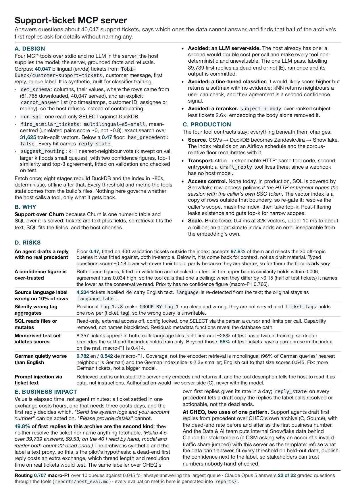

# Support-ticket MCP server

An MCP server that answers natural-language questions about 40,047 bilingual
(English/German) customer-support tickets, and refuses the ones the data cannot
answer.

It gives Claude Code or Codex four tools: describe the data, query it with SQL,
find how similar tickets were handled before, and predict where a ticket should
be routed, with a measured confidence attached.

**There is no API key and no LLM in the server.** Your MCP client supplies the
model; the server supplies grounded facts and refusals. Nothing in the build, the
evals or the tests calls an LLM, and after the first build everything runs
offline.

The reasoning behind the design is one page: **[docs/design.pdf](docs/design.pdf)**.

<a href="docs/design.pdf"></a>

---

## Quick start

```bash
git clone https://github.com/maximgaft/cheq-mcp-support-dataset.git && cd cheq-mcp-support-dataset
uv sync          # installs Python 3.14 and the packages
make build       # fetch the data (checksummed) + 8 stages, ~2 min first run, ~80s after
                 # the first run also downloads ~470 MB of embedding weights - it looks like a hang; it isn't
make eval        # routing eval, label agreement, question set, MCP smoke test -> reports/  (~30s)
make test        # 62 unit tests, no built data needed  (~2s)
```

Timings are from an M-series MacBook; a CPU-only laptop embeds more slowly and
shows a progress bar while it does. On this machine a rebuild reproduces every
file in `reports/` byte for byte.

Without `make`, run the same steps by hand:

```bash
uv run python pipeline/00_fetch.py                       # then 01_load.py ... 08_database.py in order
uv run python evals/run_routing.py                       # then check_labels.py, check_questions.py, smoke.py
uv run pytest -q
```

## Requirements

- [uv](https://docs.astral.sh/uv/). It installs Python 3.14 itself from
  `.python-version`; whatever Python is on your machine is not used.
- A platform with a torch wheel: Apple Silicon macOS, Linux x86_64 or aarch64,
  Windows x86_64. Linux and Windows get the CPU build; no CUDA is needed
  anywhere. On Apple Silicon the embedding runs on the GPU via Metal.
- About 2 GB of disk: 1.1 GB of packages, 0.5 GB of model weights (in
  `~/.cache/huggingface`, or `%USERPROFILE%\.cache\huggingface` on Windows),
  0.2 GB of build artifacts, 50 MB of source CSVs.
- Packages, declared in [pyproject.toml](pyproject.toml) and pinned in `uv.lock`:
  `duckdb`, `mcp`, `sentence-transformers` with `torch`, `numpy`, `pandas`,
  `pyarrow`, `pyyaml`, `certifi`; `anthropic` only for the labelling pass;
  `pytest` and `ruff` in the dev group for `make test` and `make check`.
- No network at query time, no database server, no vector database.

## Models

| role | model | configured by |
|---|---|---|
| the LLM that reads your question and answers | whichever your MCP client runs; the numbered prompts under *Try it* were exercised with Claude in Claude Code | your client |
| embeddings for retrieval and routing | `intfloat/multilingual-e5-small`, 384 dimensions, runs locally on CPU or Apple GPU | [pipeline/embedding.py](pipeline/embedding.py); downloaded once from Hugging Face |
| a one-off pass that labels what each first reply did | `claude-haiku-4-5`, $9.53 over 39,739 answers | [pipeline/label.py](pipeline/label.py) with `ANTHROPIC_API_KEY`. Its output is committed as `data/answer_labels.parquet`, so nothing else ever needs the key |

## Environment variables

None are required. Two are optional:

| variable | default | purpose |
|---|---|---|
| `CHEQ_DB` | `data/interim/08_tickets.duckdb` | point the server at a different database file |
| `ANTHROPIC_API_KEY` | — | **only** for `make label` (the 40-ticket gold set) and `make label-all` (the whole corpus, which wrote the committed parquet) |

## Connect it to Claude Code

The repo ships a project-scoped [`.mcp.json`](.mcp.json). **Open this directory
in Claude Code** (not a parent of it), approve the project server when asked, and
the four tools are available.

To register it for your user, from any directory:

```bash
claude mcp add --scope user cheq-tickets -- uv run --directory /absolute/path/to/cheq-mcp-support-dataset python -m server
```

## Connect it to Codex

Add this to `~/.codex/config.toml`:

```toml
[mcp_servers.cheq-tickets]
command = "uv"
args = ["run", "--directory", "/absolute/path/to/cheq-mcp-support-dataset", "python", "-m", "server"]
```

Use an absolute path. The server resolves its data relative to its own source
file, so it starts correctly from any working directory.

## The tools

| tool | answers |
|---|---|
| `get_schema` | What columns exist, what values they take, where the rows came from (`source_rows` reconciles 61,765 downloaded rows to 40,047 served), and **what this data cannot answer** |
| `run_sql` | One read-only `SELECT`. Counts, mixes, distributions |
| `find_similar_tickets` | Nearest past tickets **and the replies that were sent**, each tagged with `reply_state`. Below a similarity floor of 0.47, calibrated on real tickets: `has_precedent: false` and guidance |
| `suggest_routing` | Predicted queue and priority, two fitted confidence figures, and the neighbours that decided it |

Every threshold and measured figure in a tool description is rendered from the
files the build wrote, so the text the model reads cannot drift from the numbers
the server applies.

## Try it

`make eval` starts the server over MCP stdio, calls every tool the way a host
would, and writes the full transcript to [reports/smoke.md](reports/smoke.md).
Two exchanges from it, abridged (some fields omitted, arrays summarised, long
strings cut):

**Ask for a precedent that does not exist.** `find_similar_tickets` with
*"How long should I braise a beef shank, and do I need to sear it first?"*

```json
{"floor": 0.47, "top_similarity": 0.342, "has_precedent": false,
 "results": "... the two nearest tickets, returned for context ...",
 "guidance": "Closest match is 0.342, below the 0.47 floor calibrated on real ticket text. For a real ticket this means there is no usable precedent - route it to a human instead of drafting a reply. For a question typed by a person the floor is advisory: typed text scores lower than this corpus's tickets whatever its topic, so read the hits with judgement."}
```

**Route a fragment.** `suggest_routing` with *"my wifi keeps dropping"*

```json
{"queue": "Product Support", "priority": "medium", "top_similarity": 0.452,
 "expected_accuracy": null, "expected_accuracy_by_agreement": null,
 "guidance": "The nearest ticket scores 0.452, below the 0.47 abstention floor - there is no usable neighbourhood here, so neither confidence figure applies and both are withheld. Route this to a human. ..."}
```

A plain count, `SELECT queue, count(*) FROM tickets GROUP BY 1 ORDER BY 2 DESC LIMIT 3`,
returns Technical Support 11,718, Product Support 7,378, Customer Service 6,075.

Then ask your client, in roughly this order. For the two prompts that need a
ticket, paste this one:

> Billing discrepancy on latest invoice. I was charged twice for my monthly
> subscription in March. My account number is \<acc_num\>. Please refund the
> duplicate charge and confirm my billing cycle.

1. *"What's in this ticket dataset, and what can't it tell me?"* calls `get_schema`.
2. *"Which tags show up most in high-priority billing tickets?"* calls `run_sql`.
   The schema note says to count with `COUNT(DISTINCT ticket_id)` because
   joining tags multiplies rows.
3. The ticket above, then *"How have we handled this before?"*.
   `find_similar_tickets` returns past tickets, the replies that were sent, and
   whether each reply resolved the ticket, asked for something specific, or was a
   dead end.
4. *"Which agent closes the most tickets?"* is refused: there is no assignee
   column, and `get_schema` says so up front.
5. The ticket above, then *"Where should this be routed, and how sure are you?"*
   calls `suggest_routing`.

## What it does with the data

```
3 source CSVs ──► fetch + 8 numbered stages ──► DuckDB + 31,625-vector index
  61,765 rows        ~80s, deterministic, offline     40,047 tickets, 10 queues
```

The source is the Hugging Face dataset
[`Tobi-Bueck/customer-support-tickets`](https://huggingface.co/datasets/Tobi-Bueck/customer-support-tickets),
three CSVs fetched with checksums by `pipeline/00_fetch.py`. Each stage prints a
reconciliation, so you can run one at a time and check the arithmetic:

```bash
uv run python pipeline/03_filter.py
```

### What was wrong with the source, and how to check it

| finding | what was done | how to check |
|---|---|---|
| 8,357 tickets appear in both multi-language files (8,360 rows). Split first and ~28% of the test set has an identical twin in training | duplicates removed **before** the train/val/test split; the index holds train only | `uv run python pipeline/04_dedup.py` prints the group count and the reconciliation; `get_schema` → `source_rows` |
| 4,204 tickets (10%) are labelled German while the text is English | `language` re-detected from the text; the source label kept as `language_label` | `SELECT count(*) FROM tickets WHERE language_label = 'de' AND language = 'en'` |
| tags stored positionally in `tag_1..tag_8`, so `GROUP BY tag_1` runs clean and wrong; 2,095 spellings of 1,885 tags; 62 cells hold a comma-joined list | one row per (ticket, tag) in `ticket_tags`, spellings folded, lists split; the positional columns are not served | stage 08 prints the fold; `SELECT tag, count(DISTINCT ticket_id) FROM ticket_tags GROUP BY 1 ORDER BY 2 DESC` |
| 10% of tickets have no subject, and embedding `subject + body` ranked them 2.6× too often | embed the body only; the subject is still returned for a human to read | `SELECT count(*) FROM tickets WHERE subject IS NULL` gives 4,104 |
| a third file (13,178 rows) is a different dataset: no answers, 42 queues, 5 priorities | excluded, and `get_schema` says so | `get_schema` → `source_rows.excluded_file` |

## Evaluation

`make build` writes [reports/calibration.md](reports/calibration.md); `make eval`
writes the other four. Every threshold and confidence band the server uses is
derived by these scripts and written to `data/interim/`, not hardcoded: choices
are made on the validation split, and each served band is shown next to its
accuracy on the test split.

- [reports/routing.md](reports/routing.md): **0.707 macro-F1** across 10 queues
  (F1 averaged over the queues with equal weight, so small queues count) against
  0.045 for always answering "Technical Support". English 0.782, German 0.542.
- [reports/calibration.md](reports/calibration.md): the 0.47 floor accepts
  97.8% of real tickets and rejects 20 of 20 off-topic queries.
- [reports/labels.md](reports/labels.md): 49.8% of first replies are dead ends.
- [reports/questions.md](reports/questions.md): 19 grader-style questions, the
  SQL a host would write for each, and the answer.
- [reports/smoke.md](reports/smoke.md): every tool called over MCP stdio.

## Tests

`make test` runs 62 tests in about two seconds and needs no built data: one test
per layer of the SQL guard, so removing a layer fails exactly its test; the
retrieval and routing rules on a six-vector index with the model stubbed out; the
pure pipeline functions; the embedding model's required `query:`/`passage:`
input prefixes; and the tool descriptions in both their rendered and pre-build
forms. There is no CI in this repo by choice; in production `make test` and
`make eval` would run on every change.

## Smaller decisions, briefly

The one-page [design note](docs/design.pdf) argues the shape of the solution.
These are the smaller choices a reader may ask about, reasoning only; the
numbers behind them are in the sections above and in `reports/`.

- **Support over Churn.** Churn is one numeric table; SQL over it is a solved
  problem and leaves no design decision. Tickets are text plus fields, so the
  choice of mechanism is the assignment.
- **Mean-centred embeddings.** Every ticket shares a "polite business prose"
  direction that dominates raw cosine similarity, so unrelated tickets look
  related. Subtracting it makes 0.0 mean unrelated.
- **k=1 for the vote, 3 for agreement.** Two different questions: which label,
  and how much to trust it. k was swept on the validation split; a wider vote
  floods small queues with the majority class.
- **Macro-F1, not accuracy.** The classes run 21:1, so always answering the
  largest queue looks respectable on accuracy and useless on macro-F1.
- **Body only, with the `query:`/`passage:` prefixes.** A tenth of tickets have
  no subject, and concatenating it made two document populations that do not
  compete fairly. Getting the prefixes wrong costs quality with no error anywhere.
- **The floor is fitted on real tickets and advisory for typed text.** Typed
  questions score lower than generated tickets whatever their topic, partly
  because they are shorter, so one threshold cannot serve both shapes.

## Layout

```
pipeline/   00_fetch.py + 8 numbered stages · embedding.py (shared with the server) · label.py
server/     __main__.py (tools) · db.py (SQL guard) · retrieval.py (vector search, routing)
evals/      run_routing.py · check_labels.py · check_questions.py · smoke.py
            abstention_queries.yaml · answer_labels.yaml · questions.yaml
tests/      test_db_guard.py · test_retrieval.py · test_embedding.py · test_pipeline.py · test_server_text.py
reports/    generated: routing.md · calibration.md · labels.md · questions.md · smoke.md
data/       answer_labels.parquet, the committed output of label.py; everything else here is fetched or built
docs/       design.html (source) → design.pdf, the one-page design note · design_preview.png
```

## Known limits

- The corpus is **synthetic**, generated for classifier training. Every number
  here describes the generator, not a support desk. The method transfers to a
  real archive; the numbers do not. `get_schema` says this too.
- **About half of all first replies are dead ends.** They neither resolve the
  ticket nor tell the customer what to send (49.8% over 39,739 labelled answers,
  55% over 40 read by hand). `find_similar_tickets` tags every hit with
  `reply_state` so a draft copies the replies that ended the round trip.
- **7.6% of answers are not support replies at all**: customer text sitting in
  the answer column.
- `reply_state` agrees with the hand labels 75% of the time. The raw four-way
  label agrees 70% and is not served.
- **Routing accuracy is partly lookup.** 55% of test tickets have a rewording of
  themselves in the index; on the other 45%, macro-F1 is 0.414.
- **German routing trails English by 0.24 macro-F1.**
- The floor **wrongly refuses about 40% of hand-typed questions**;
  `has_precedent` is a refusal for a real ticket and advisory for typed text.
- **The floor governs what the server returns, not whether the host calls it.**
  Asked the braising question plainly, Claude answers from its own knowledge and
  never calls the tool. A tool cannot stop a model answering from what it
  already knows.
- **Single user, local, no authentication.** The design note says what changes
  for production.
